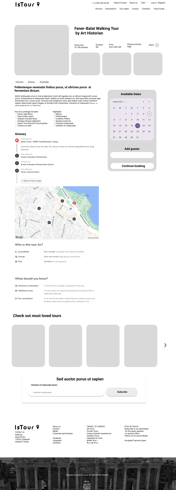

# Project Title

IsTour

## Overview

isTour is a web application designed for exploring the cultural landmarks across Istanbul. It provides users with a seamless experience to discover and enjoy guided tours in various locations within the city.

### Problem

Tourists and locals often face difficulties in finding reliable and interesting city tours that meet their preferences. Information on available tours can be scattered, inconsistent, and often lacks user-friendly booking options. isTour addresses these pain points by consolidating tour options and providing detailed information. Checkout options are planned to be available in a future release.

### User Profile

- Tourists:
  - Looking to explore different cities in Istanbul.
  - Seeking reliable tour options.
  - Wanting detailed information about tours.
- Local residents:
  - Interested in discovering hidden gems in their own city.
  - Looking for curated tour experiences.
- Tour operators:
  - Offering city tours and seeking a platform to reach a wider audience.

### Features

- Tour Listings

  -As a user, I want to browse available city tours in Istanbul.

  - As a user, I want to filter tours based on category, duration, and price.

- Tour Details

  - As a user, I want to view detailed information about each tour, including itinerary

## Implementation

### Tech Stack

- React
- react-router
- axios
- Node.js
- Express
- MySQL
- knex

### APIs

Map API

### Sitemap

- Home Page:

  - Overview of available tours and highlights.

- Tour Listings Page:

  - Filterable list of tours by category, price, and other criteria.

- Tour Details Page:
  - Detailed information about a selected tour, including itinerary

### Mockups

Mockups are developed with icluding functionality from the further releases. Current release will be focusing on the base functionality.

#### Homepage

#### All Tours Page

#### Tour Details Page

#### Login Page

#### About Page

### Data

Tours:

Tour ID
Tour Name
Neighborhood
Description
Itinerary
Duration
Activity Level
Price

### Endpoints

**GET /tours**

- Get list of tours with optional filters for city, date, duration, and price.

**GET /tours/:id**

- Get detailed information for a specific tour by ID.

### Auth

Auth is planned for the further release.

## Roadmap

Sprint 1:

Set up project structure for frontend and backend.
Implement basic routing and layout for the frontend.
Set up database and create initial tables.

Sprint 2:

Develop tour listing and detail pages.
Integrate API for displaying tour details.
Create endpoints for fetching tours.

Sprint 3:

Conduct user testing and gather feedback.
Optimize and debug the application.

## Nice-to-haves

\_ Interactive map

- Interactive date picker
- Auth
- Send a sign up confirmation email to the user
- Creating a booking checkout and a booking listing
- Manage my bookings functionality
- Contact form
- About us page
- Subscribe to the newsletter
- Travel guide with articles
- Expanded DB with users, bookings, travel company information
